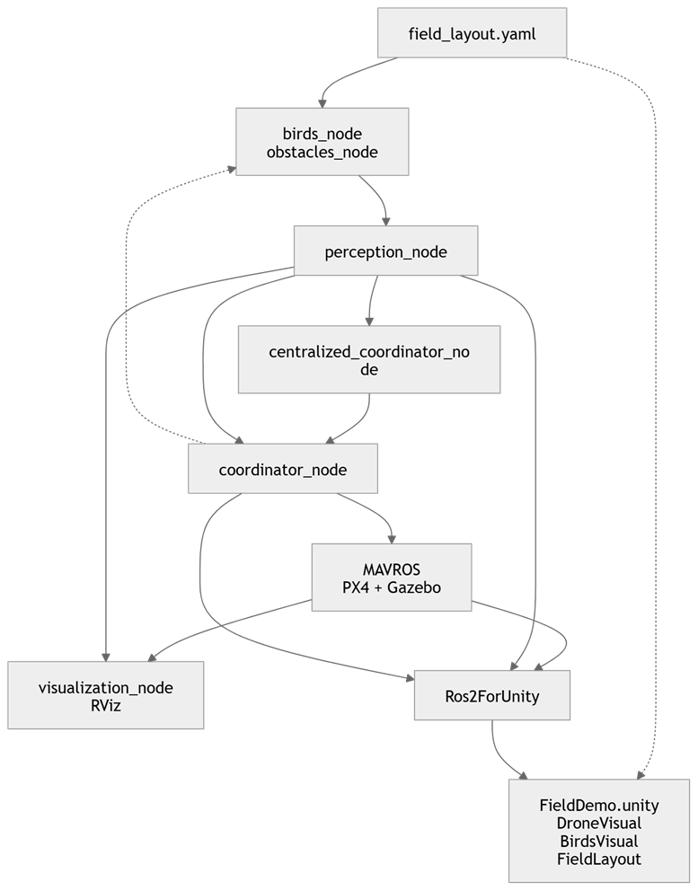
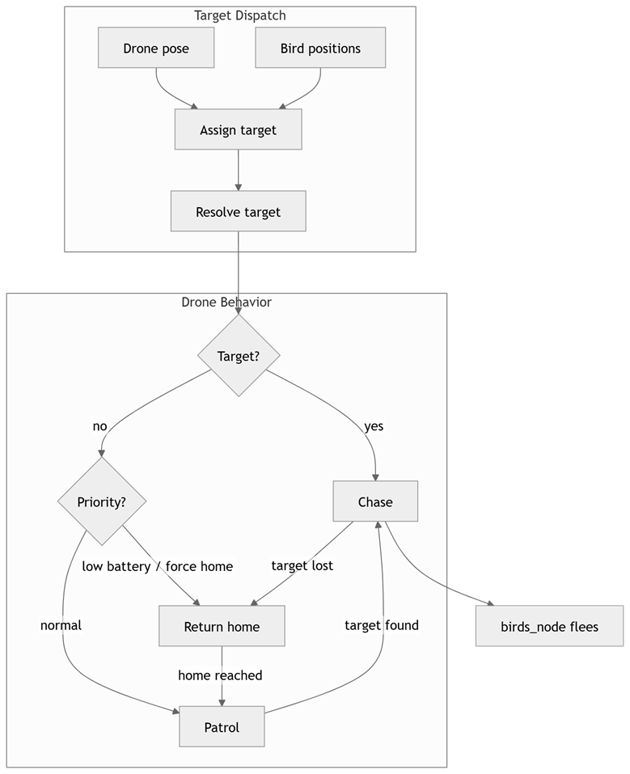
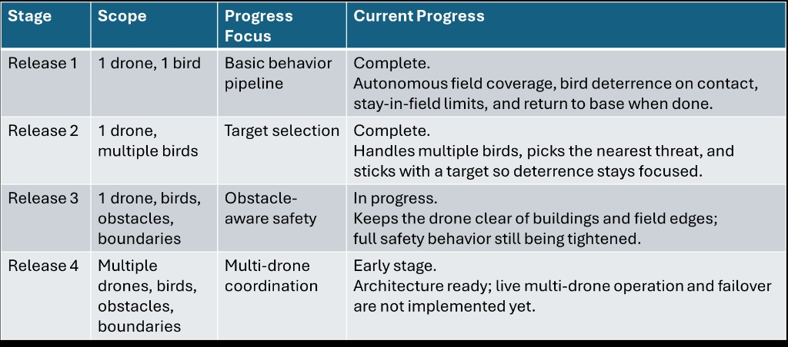

# Drone bird-deterrence (ROS 2 + PX4 / Gazebo / MAVROS)

Two simulated drones patrol a field, receive centralized bird assignments, and fly PX4 OFFBOARD setpoints through MAVROS. Birds, obstacles, and patrol geometry come from `config/field_layout.yaml`.

**Needs:** Ubuntu 22.04, ROS 2 Humble, PX4 SITL, Gazebo, MAVROS 2. Optional: RViz or Unity (`unity/FieldDemo`, `./scripts/sync_unity.sh`).

## Repository layout

```
config/
  field_layout.yaml          # birds, obstacles, patrol waypoints, speeds
  field_layout_demo.yaml     # alternate layout (set FIELD_LAYOUT_PATH)

doc/
  stack.png behavior.png roadmap.png

scripts/
  px4_sitl.sh mavros_sitl.sh mavros_multi_sitl.sh   # sim + MAVROS (T1-T2)
  build.sh launch.sh launch_demo.sh stop_app.sh reset.sh
  sync_unity.sh launch_unity.sh

src/drone_system_pkg/
  launch/
    system.launch.py         # default stack
    demo.launch.py
  drone_system/
    field_layout.py          # load YAML (shared with Unity)
    birds_node.py            # sim birds -> /birds/raw
    bird_behavior.py         # wander / flee / recover math
    obstacles_node.py        # static obstacles
    perception_node.py       # relay to /birds/positions, /obstacles/positions
    centralized_coordinator_node.py   # assign target per drone
    coordinator_runtime.py   # patrol / chase / return (coordinator_node)
    visualize_node.py        # RViz markers
    coordination/
      assignment.py          # nearest-bird greedy assign
      behavior_tree.py       # mode selection
      models.py

unity/FieldDemo/
  Assets/Scripts/            # DroneVisual, BirdsVisual, FieldLayout, …
  Assets/StreamingAssets/field_layout.yaml
  # Ros2ForUnity/Plugins/ not in git (see Unity section)
```

## Run

| Terminal | Command |
|----------|---------|
| T1 | `./scripts/px4_sitl.sh` |
| T2 | `./scripts/mavros_sitl.sh` |
| T3 | `./scripts/build.sh` then `./scripts/launch.sh` |
| T4 | `rviz2`, markers `/drone_marker`, `/bird_markers`, `/obstacle_markers` (Fixed Frame: `map`) |

Sim time (when Gazebo clock is up): `USE_SIM_TIME=true ./scripts/launch.sh`

Alternate layout: `FIELD_LAYOUT_PATH=./config/field_layout_demo.yaml ./scripts/launch_demo.sh`

## MAVROS / PX4 status

```bash
ros2 topic echo /mavros/state --once
```

## Unity (optional view)

Unity does **not** run PX4, bird physics, or coordination. `FieldDemo` only **mirrors** ROS (`/mavros/local_position/pose`, `/birds/positions`, obstacles) for a nicer demo view via Ros2ForUnity.

**Authoritative for logic:** `config/field_layout.yaml` and the ROS nodes. Unity reads a copy under `Assets/StreamingAssets/` (`./scripts/sync_unity.sh` copies it on launch).

**YAML vs scene:** the Unity scene was tweaked in the Editor (props, scale, placement). It may not line up exactly with the YAML anymore. Trust YAML + ROS for behavior; treat Unity as presentation only.

**Ros2ForUnity `Plugins/`** are not in git (too large). Install [ROS2 For Unity](https://github.com/RobotecAI/ros2-for-unity) into `unity/FieldDemo` on each machine.

## Perception node (shim, not vision)

`perception_node` is a **topic relay** (`/birds/raw` -> `/birds/positions`, `/obstacles/static` -> `/obstacles/positions`). There is no camera or detector yet.

It keeps a stable “detected targets” interface so **coordination code does not care** whether birds come from `birds_node` today or a real perception stack later.

**Current default:** two identical drones (`drone_1`, `drone_2`) with centralized assignment, nearest-threat bird fleeing, and merged chased masks. Later: different drone roles in `coordination/`, or real perception on `/birds/positions` without changing the coordinators.

## Stack



## Behavior



## Roadmap



## Topics

| Topic | Role |
|-------|------|
| `/birds/positions` | Bird poses |
| `/obstacles/positions` | Obstacles (`z` = radius) |
| `/drone_1/battery` | Drone 1 battery telemetry from MAVROS |
| `/drone_2/battery` | Drone 2 battery telemetry from MAVROS |
| `/drone_1/local_position/pose` | Drone 1 pose |
| `/drone_2/local_position/pose` | Drone 2 pose |
| `/drone_1/setpoint_position/local` | Drone 1 setpoints |
| `/drone_2/setpoint_position/local` | Drone 2 setpoints |
| `/birds/chased_mask` | Aggregated per-bird chase mask (OR across drones) |
| `/central/assignment/drone_1` | Drone 1 assigned bird index |
| `/central/assignment/drone_2` | Drone 2 assigned bird index |

## If chase does not start

1. `USE_SIM_TIME=true ./scripts/launch.sh` after PX4 is running.
2. `./scripts/reset.sh` then relaunch (duplicate nodes).
3. Check coordinator logs for `FSM -> chase` (MAVROS status commands above).
